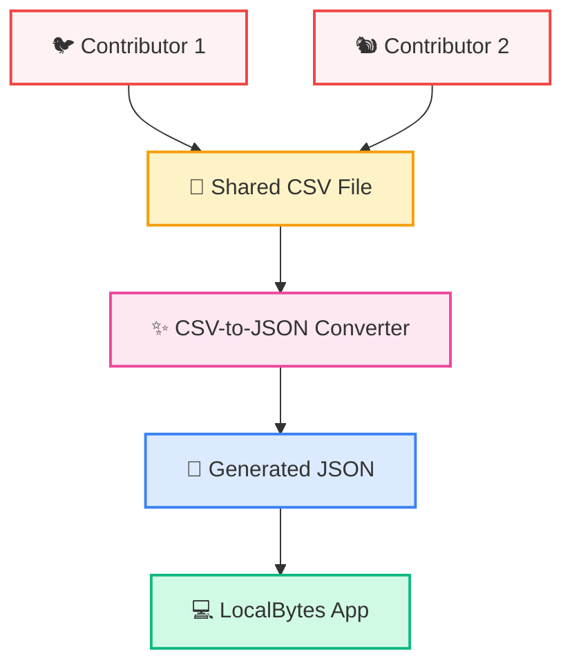

# LocalBytes 🍔
✨ [LIVE DEMO](https://kazvee.github.io/localbytes/) ✨

## Description & Use Case
LocalBytes is a lightweight, responsive app to browse restaurants, filter by cuisine, and view recommended dishes.

## Data Update Flow 
Restaurant data is handled via a straightforward CSV-to-JSON workflow:
* **Shared CSV**: Users maintain a shared CSV file containing restaurants visited, favourite dishes, and location details. When new entries are added, the CSV is added to `src/data` for the next app refresh.
* **Conversion to JSON**: Before running or building the app, the CSV is converted to JSON using the built-in utility (`npm run convert`). This JSON is what the app reads at runtime.
* **Static site usage**: The app renders restaurant data directly from the JSON. No database is required, keeping the site fast and mobile-friendly.

### Workflow Diagram 📑

## Built With 👩‍💻
* [React](https://reactjs.org/)
* [Vite](https://vitejs.dev/)
* [Bootstrap](https://getbootstrap.com/)
* [Fuse.js](https://fusejs.io/) for fuzzy search
* CSV-to-JSON conversion utility

## Thanks & Acknowledgements 🤗
* [Hamburger](https://icons8.com/icon/H9McyiOAZ5XF/hamburger), [GitHub](https://icons8.com/icon/I7n6n02hutM5/github), and [Search](https://icons8.com/icon/hO06R7BwJumP/search) icons by [Icons8](https://icons8.com)

## Installation 💻 
* Clone this repo to your local machine. 
* Install dependencies: `npm i` (or `npm install`). 
* Create file restaurants.csv inside src/data, using example.restaurants.csv as a reference to ensure correct headers and formatting. 

### Start the Development Server 
* Run `npm run dev`. 
* The development app will be served at [http://localhost:5173](http://localhost:5173/). 

### Build the Production-Ready Application 
* Run `npm run build`. 
* Static pages ready for deployment will be generated inside the dist folder. 

#### Start the Production Server 
* Run `npm run preview`. 
* The production app will be served at [http://localhost:4173](http://localhost:4173/).